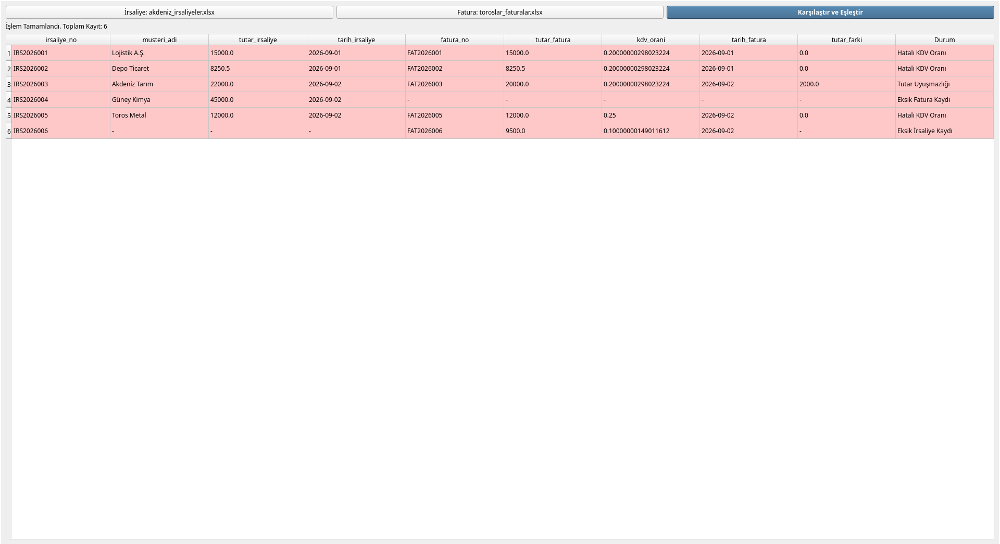

# Navlun ve Fatura Veri Eşleştirme Otomasyonu

Bu proje; **Akdeniz şubesi** tarafından iletilen navlun irsaliye verileri ile **Toroslar mali birimi** fatura kayıtları arasındaki uyuşmazlıkları otomatize şekilde tespit etmek amacıyla geliştirilmiş Python/PyQt5 tabanlı bir masaüstü yazılımıdır.

Manuel Excel eşleştirmelerindeki insan kaynaklı hataları ve zaman kaybını ortadan kaldırmak için tasarlanmıştır.

## Özellikler

- **Masaüstü Arayüzü (PyQt5):** Kolay kullanım sunan sürükle/bırak veya dosya seçici arayüz.
- **Hızlı Veri İşleme (Pandas):** Binlerce veriyi milisaniyeler içinde `irsaliye_no` bazında birleştirme ve analiz etme (`pd.merge`).
- **Veri Tabanı Mimarisi (SQLite & SQLAlchemy):** Veri bütünlüğü (`UNIQUE` ve `Primary Key`) sağlanmış yerel veri depolama.
- **Görsel Hata Vurgulama:** Eşleşmeyen tutarlar, hatalı KDV oranları ve eksik kayıtların arayüz tablosunda kırmızı renkle otomatik vurgulanması.
- **Veri Doğrulama:** Arayüz seviyesinde hatalı veri girişlerini önleyen kontrol mekanizmaları.

---

## Proje Dizini

otomasyon_projesi/
├── main.py                # PyQt5 Masaüstü Arayüzü ve Giriş Noktası
├── database.py            # SQLAlchemy Veritabanı Modelleri ve SQLite Kurulumu
├── core.py                # Pandas Eşleştirme ve Analiz Algoritması
├── generate_test_data.py  # Test İçin Örnek Excel Verisi Üretici
└── README.md              # Proje Dokümantasyonu

## Kurulum ve Çalıştırma (Linux)
### 1. Sistem Bağımlılıkları ve Sanal Ortam

Terminalinizde aşağıdaki komutları çalıştırarak gerekli bağımlılıkları yükleyin ve sanal ortamı (venv) aktif edin:

# Sistem paketlerini güncelleyin ve Qt/venv bağımlılıklarını kurun
sudo apt update
sudo apt install -y python3-venv python3-pyqt5

# Proje dizinine gidin
cd otomasyon_projesi

# Sanal ortamı oluşturun ve aktif edin
python3 -m venv venv
source venv/bin/activate

### 2. Python Kütüphanelerinin Yüklenmesi

pip install PyQt5 pandas sqlalchemy openpyxl

## Kullanım

python main.py

### Eşleştirme Adımları

- "1. Akdeniz İrsaliye Excel'i Seç" butonuna tıklayarak irsaliye dosyasını seçin.
- "2. Toroslar Fatura Excel'i Seç" butonuna tıklayarak fatura dosyasını seçin.
- "Karşılaştır ve Eşleştir" butonuna basarak uyuşmazlık analizini çalıştırın.
- Başarılı eşleşmeler Yeşil, uyuşmazlık içeren veya eksik kayıtlar Kırmızı renkle tablolacaktır.

## Kullanılan Teknolojiler

- Dil: Python 3.x
- GUI: PyQt5
- Veri Analizi: Pandas
- ORM / DB: SQLAlchemy / SQLite
- Excel Okuma: OpenPyXL